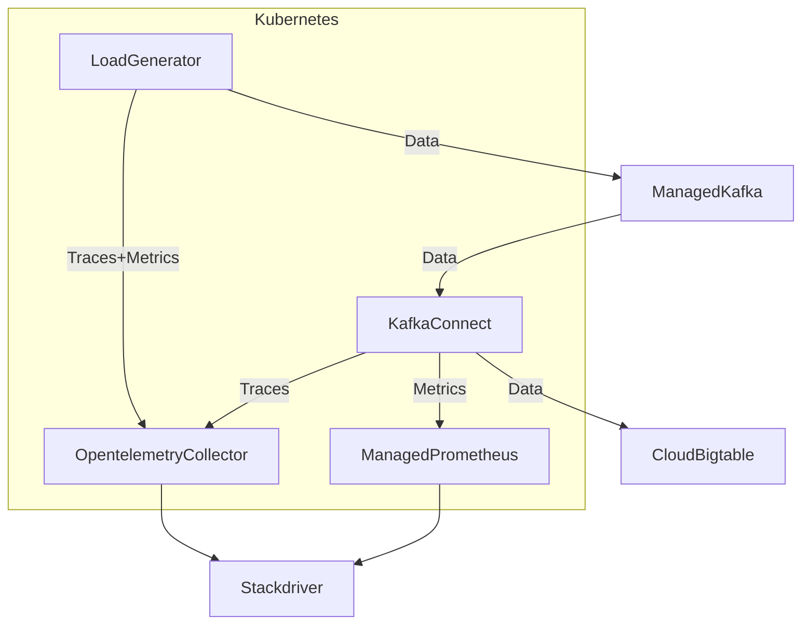

# Performance tests of Cloud Bigtable Sink Connector for Kafka Connect

## Measured values
We want to measure these latencies under a constant load:
- from the moment the Kafka producer starts writing to the moment the data lands in Cloud Bigtable,
- from the moment the message is in Kafka to the moment the data lands in Cloud Bigtable,
- from the moment our sink receives the data (via `put()` method call) to the moment the data lands in Cloud Bigtable.

Of course, results are not valid if any error occurs.

## Infrastructure
The performance test infrastructure is all set up within GCP.

The high level overview of it is presented in the following diagram:


### Implementation details
- Strimzi Kafka operator is used to configure Kafka Connect.
- `terraform` code describing used infrastructure is available in directory [terraform](terraform/).
- Some Kubernetes manifests used are available in directory [kubernetes](kubernetes/).

## Infrastructure configuration
### Location
The tests were conducted in `europe-central2-a` (Warsaw, Poland) zone.

### Versions
- Kubernetes: 1.31.5
- `terraform`: 1.10.5
    - `hashicorp/google` provider: 6.19.0
    - `hashicorp/kubernetes` provider: 2.35.1
- Strimzi Kafka Operator: 0.45.0
    - Kafka Connect: 3.8.1

### Cloud Bigtable
Single-node cluster with SSD storage.

See [bigtable.tf](terraform/bigtable.tf) for details.

### Managed Kafka
A cluster with 3 vCPU and 3 GB of RAM.

See [kafka.tf](terraform/kafka.tf) for details.

### Kubernetes
A cluster consisting of 4 `n1-standard-4` machines (4 vCPU, 15 GB of RAM)

#### Kafka Connect
A three-node cluster with each machine reserving 2.66 vCPU and 6 GB of RAM.

Its metrics are exported using [JMX Prometheus exporter](https://github.com/prometheus/jmx_exporter).

See [kubernetes.tf](terraform/kubernetes.tf) for details.

#### Load generator
A single Kubernetes Pod reserving 2 vCPU and 8 GB of RAM and running a [simple script](terraform/generate_load.sh) consisting of a three-part shell pipeline:
- [a simple script generating data of desired shape](terraform/main.rs),
- [`pv`](https://www.ivarch.com/programs/pv.shtml) used to rate limit the generator script,
- upstream-provided wrapper for Kafka producer, `kafka-console-producer.sh`.

#### Opentelemetry Collector
An autoscaled service consisting of 6..10 Pods each limited to 0.2 vCPU and 0.8GB of RAM.

#### Managed Prometheus
An autoscaled service using default configuration.

## Components' configuration
### Kafka clients (Kafka Connect and the load generator)
Kafka clients used by the load generator and Kafka Connect are configured to optimize latency as suggested in [Confluent's "Optimizing Your Apache Kafka® Deployment" whitepaper](https://www.confluent.io/resources/white-paper/optimizing-your-apache-kafka-deployment/).

Producer settings:
- `linger.ms`: `0`
- `compression.type`: `none`
- `acks`: `1`
Consumer settings:
- `fetch.min.bytes`: `1`

### Kafka Connect
Replication factor of Kafka topics used for internal state storage: the same as in Kafka.

Key converter: `org.apache.kafka.connect.json.JsonConverter` with schemas disabled.

Value converter; `org.apache.kafka.connect.json.JsonConverter` with schemas enabled.

It is also configured to use TLS when accessing Kafka API.

### Kafka topic
The topic is configured to use 60 partitions with replication to all 3 Kafka nodes.

### Cloud Bigtable Sink Connector
The full configuration of the sink connector is available in [kubernetes.tf](terraform/kubernetes.tf).
The interesting parts of these settings are:
```json
{
    "auto.create.column.families": "false",
    "auto.create.tables": "false",
    "error.mode": "FAIL",
    "insert.mode": "upsert",
    "max.batch.size": "1000",
    "retry.timeout.ms": "90000",
    "tasks.max": "60",
    "value.null.mode": "write"
}
```

### Load generator
[generate_load.sh](terraform/generate_load.sh) and [main.rs](terraform/main.rs) are configured using environment variables:
- `KAFKA_CONNECT_BOOTSTRAP_SERVERS`, `KAFKA_CONNECT_TLS`, `KAFKA_CONNECT_SASL_USERNAME`, `KAFKA_CONNECT_SASL_PASSWORD_FILE`, `KAFKA_CONNECT_SASL_MECHANISM` - the same meaning as in Strimzi's Kafka Connect
- `THROUGHPUT` - number of messages to be sent per second
- `TIMEOUT` - duration of load generation (default unit: seconds)
- `TOPIC` - topic to write to
The script generates data in two shapes:
- a String key and a String value - when `COLUMN_FAMILIES` is equal to `0`,
- a String key and a Struct mapping to `COLUMN_FAMILIES` column families each containing `COLUMNS_PER_FAMILY` columns.
The values in each cell have `FIELD_VALUE_SIZE` bytes each.
Note that we use JSON with in-band schema, so messages contain schema bytes.
This overhead is not insignificant, for example:
```bash
# Just a String value
$ FIELD_VALUE_SIZE=100 COLUMN_FAMILIES=0 COLUMNS_PER_FAMILY=1 ./gen 2>/dev/null | cut -d"|" -f2 | head -1 | wc --bytes
158
```

The default values are:
- `THROUGHPUT` - `3000`
- `TIMEOUT` - `600`
- `COLUMN_FAMILIES` - `0`
- `COLUMNS_PER_FAMILY` - `1`
- `FIELD_VALUE_SIZE` - `100`

## Tracing setup
### Tracing overview
All the code (the load generator, Kafka Connect, and our sink) is instrumented using Opentelemetry.

In case of the load generator and Kafka Connect, the instrumentation is automatic, because Kafka clients (both reader and producer) are supported by [the Opentelemetry agent](https://opentelemetry.io/docs/zero-code/java/agent/), which we run alongside these two components.

The sink is instrumented by calling appropriate functions in the code.
Interestingly, it also uses the Opentelemetry agent indirectly - our code uses `GlobalOpenTelemetry` which is injected by the agent.

### Tracing data path
All the traces pass through Opentelemetry collector, which is responsible for sending it into Google Stackdriver.

### Tracing code
Tracing code is not present in the release code.
The code of tracing implementation is available in [`MessageTracer.java`](MessageTracer.java).
To enable tracing, put it into `src/main/java/com/google/cloud/kafka/connect/bigtable/tracing` and apply [`enable_tracing.patch` git patch](enable_tracing.patch).

## Test steps
### High level overview
A single test run consists of just running a load generator for a stretch of time and collecting metrics and traces from all the components.

### Required programs
- `terraform` (with GCP credentials configured)
- `kubectl`
- `jq`
- `bash` + coreutils
- `gcloud` (logged into the desired project)

### Preparation
- Adjust variables such as project name and region in [`main.tf`](terraform/main.tf)
- Adjust the test config by modifying variables in [`kubernetes.tf`](terraform/kubernetes.tf).

### Running tests
[`perf_test.sh`](terraform/perf_test.sh) is the script that executes all the needed steps:

Always run it from the directory it resides in.

#### `perf_test.sh prepare`
Needs to only be executed once at the beginning.

It prepares all the environment: sets up the infrastructure, builds the docker container containing our connector and load generator, creates helper Kubernetes resources (Strimzi Kafka Operator, Opentelemetry collector, Managed Prometheus).

It is idempontent.

#### `perf_test.sh run`
Creates Cloud Bigtable table and Kafka topic and then executes a performance test using current configuration from .tf files.

#### `perf_test.sh cleanup`
Cleans up the environment for the next `perf_test.sh run`: removes existing Kafka Connect and the connector and deletes Kafka topic and Cloud Bigtable table.

#### `perf_test.sh rerun`
A shortcut for `perf_test.sh cleanup && perf_test.sh run`.

#### `perf_test.sh destroy`
Removes all the infrastructure set up for the testing.

Note that it requires manual confirmation.

## Metrics
Import the following JSON into https://console.cloud.google.com/monitoring/dashboards:
[dashboard.json](dashboard.json).

You might need to replace some strings such as project name analogically to [main.tf modifications](#preparation).

## Trace analysis
You can browse traces at https://console.cloud.google.com/traces/explorer.

Despite our configuration that attempts to record trace of every record, the Opentelemetry collector cannot keep up with too high rate of traces.
To verify if it is the case you can compare rate of traces in Trace Explorer and metrics (or directly look at Opentelemetry collector's metrics).

### Basic
For basic analysis use https://console.cloud.google.com/traces/tasks.

Sample queries:
- `+root:"bigtablesink-kafka-topic publish" +span:sinkProcessing` - collect traces such that the first span is named `bigtablesink-kafka-topic publish` and a span `sinkProcessing` is present
- `+span:sinkProcessing` - collect all traces containing span named `sinkProcessing`

Query language reference: https://cloud.google.com/trace/docs/trace-filters.

Note that to compute total trace time this analysis sums time of all member spans rather than compute delta between end of the last span and start of the first one.
Still, sample traces are still very useful to look at.

### Advanced
To aggregate wall time instead of CPU time, you can use https://console.cloud.google.com/logs/analytics.

The following query calculates percentiles for three kinds of latencies described in [Measured Values](#measured-values).
Remember to adjust project, topic name, and timestamps.
Note that latency from the moment the message is in Kafka to the moment the data lands in Cloud Bigtable is calculated using the producer's trace since Kafka Connect consumer's span could start after the data arrives.
Unfortunately, it might be inaccurate if producer process lacks CPU and closes span with delay.
It's a good idea to exclude the first 60-90s and the last 30-60s of the test period so that outliers caused by scaling rate of messages up or down doesn't influence the results.

```sql
SELECT
  APPROX_QUANTILES(Process.duration_nano / 1000, 100)[OFFSET(50)] as sink_p50,
  APPROX_QUANTILES(Process.duration_nano / 1000, 100)[OFFSET(75)] as sink_p75,
  APPROX_QUANTILES(Process.duration_nano / 1000, 100)[OFFSET(90)] as sink_p90,
  APPROX_QUANTILES(Process.duration_nano / 1000, 100)[OFFSET(95)] as sink_p95,
  APPROX_QUANTILES(Process.duration_nano / 1000, 100)[OFFSET(99)] as sink_p99,
  APPROX_QUANTILES(Process.duration_nano / 1000, 1000)[OFFSET(995)] as sink_p995,
  APPROX_QUANTILES(Process.duration_nano / 1000, 1000)[OFFSET(999)] as sink_p999,
  MIN(Process.duration_nano / 1000) as sink_min,
  AVG(Process.duration_nano / 1000) as sink_avg,
  MAX(Process.duration_nano / 1000) as sink_max,
  APPROX_QUANTILES(TIMESTAMP_DIFF(Process.start_time, Publish.start_time, MICROSECOND) + (Process.duration_nano / 1000) - (Publish.duration_nano / 1000), 100)[OFFSET(50)] as kafka_to_bigtable_p50,
  APPROX_QUANTILES(TIMESTAMP_DIFF(Process.start_time, Publish.start_time, MICROSECOND) + (Process.duration_nano / 1000) - (Publish.duration_nano / 1000), 100)[OFFSET(75)] as kafka_to_bigtable_p75,
  APPROX_QUANTILES(TIMESTAMP_DIFF(Process.start_time, Publish.start_time, MICROSECOND) + (Process.duration_nano / 1000) - (Publish.duration_nano / 1000), 100)[OFFSET(90)] as kafka_to_bigtable_p90,
  APPROX_QUANTILES(TIMESTAMP_DIFF(Process.start_time, Publish.start_time, MICROSECOND) + (Process.duration_nano / 1000) - (Publish.duration_nano / 1000), 100)[OFFSET(95)] as kafka_to_bigtable_p95,
  APPROX_QUANTILES(TIMESTAMP_DIFF(Process.start_time, Publish.start_time, MICROSECOND) + (Process.duration_nano / 1000) - (Publish.duration_nano / 1000), 100)[OFFSET(99)] as kafka_to_bigtable_p99,
  APPROX_QUANTILES(TIMESTAMP_DIFF(Process.start_time, Publish.start_time, MICROSECOND) + (Process.duration_nano / 1000) - (Publish.duration_nano / 1000), 1000)[OFFSET(995)] as kafka_to_bigtable_p995,
  APPROX_QUANTILES(TIMESTAMP_DIFF(Process.start_time, Publish.start_time, MICROSECOND) + (Process.duration_nano / 1000) - (Publish.duration_nano / 1000), 1000)[OFFSET(999)] as kafka_to_bigtable_p999,
  MIN(TIMESTAMP_DIFF(Process.start_time, Publish.start_time, MICROSECOND) + (Process.duration_nano / 1000) - (Publish.duration_nano / 1000)) as kafka_to_bigtable_min,
  AVG(TIMESTAMP_DIFF(Process.start_time, Publish.start_time, MICROSECOND) + (Process.duration_nano / 1000) - (Publish.duration_nano / 1000)) as kafka_to_bigtable_avg,
  MAX(TIMESTAMP_DIFF(Process.start_time, Publish.start_time, MICROSECOND) + (Process.duration_nano / 1000) - (Publish.duration_nano / 1000)) as kafka_to_bigtable_max,
  APPROX_QUANTILES(TIMESTAMP_DIFF(Process.start_time, Publish.start_time, MICROSECOND) + (Process.duration_nano / 1000), 100)[OFFSET(50)] as total_p50,
  APPROX_QUANTILES(TIMESTAMP_DIFF(Process.start_time, Publish.start_time, MICROSECOND) + (Process.duration_nano / 1000), 100)[OFFSET(75)] as total_p75,
  APPROX_QUANTILES(TIMESTAMP_DIFF(Process.start_time, Publish.start_time, MICROSECOND) + (Process.duration_nano / 1000), 100)[OFFSET(90)] as total_p90,
  APPROX_QUANTILES(TIMESTAMP_DIFF(Process.start_time, Publish.start_time, MICROSECOND) + (Process.duration_nano / 1000), 100)[OFFSET(95)] as total_p95,
  APPROX_QUANTILES(TIMESTAMP_DIFF(Process.start_time, Publish.start_time, MICROSECOND) + (Process.duration_nano / 1000), 100)[OFFSET(99)] as total_p99,
  APPROX_QUANTILES(TIMESTAMP_DIFF(Process.start_time, Publish.start_time, MICROSECOND) + (Process.duration_nano / 1000), 1000)[OFFSET(995)] as total_p995,
  APPROX_QUANTILES(TIMESTAMP_DIFF(Process.start_time, Publish.start_time, MICROSECOND) + (Process.duration_nano / 1000), 1000)[OFFSET(999)] as total_p999,
  MIN(TIMESTAMP_DIFF(Process.start_time, Publish.start_time, MICROSECOND) + (Process.duration_nano / 1000)) as total_min,
  AVG(TIMESTAMP_DIFF(Process.start_time, Publish.start_time, MICROSECOND) + (Process.duration_nano / 1000)) as total_avg,
  MAX(TIMESTAMP_DIFF(Process.start_time, Publish.start_time, MICROSECOND) + (Process.duration_nano / 1000)) as total_max
FROM `unoperate-test.global._Trace._AllSpans` Publish, `unoperate-test.global._Trace._AllSpans` Process
WHERE
  Publish.name = "bigtablesink-kafka-topic publish"
  AND Process.name = "sinkProcessing"
  AND Publish.start_time > TIMESTAMP('2025-02-21T12:52:00 UTC')
  AND Publish.start_time < TIMESTAMP('2025-02-21T13:03:00 UTC')
  AND Publish.trace_id = Process.trace_id
```
